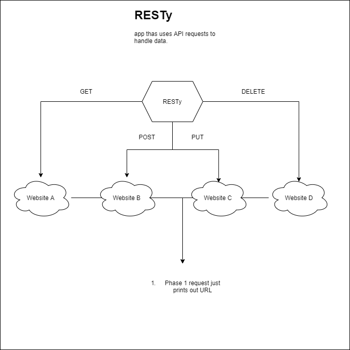

# caps
RESTY app using react to make requests

## Project: RESTy

### Author: 

### Links and Resources

- [submission PR](https://github.com/brendon-401-advanced-javascript/resty/pull/1)
- [ci/cd](https://github.com/brendon-401-advanced-javascript/resty/actions) (GitHub Actions)
- [back-end server url](http://xyz.com) (when applicable)
- [front-end application](http://xyz.com) (when applicable)

### User Stories

### Setup

#### `.env` requirements (where applicable)

#### How to initialize/run your application (where applicable)

#### How to use your library (where applicable)

#### Tests

- How do you run tests?
    - 
- Any tests of note?
- Describe any tests that you did not complete, skipped, etc
    - 

#### UML

Link to an image of the UML for your application and response to events

[Return to Directory](##Directory)